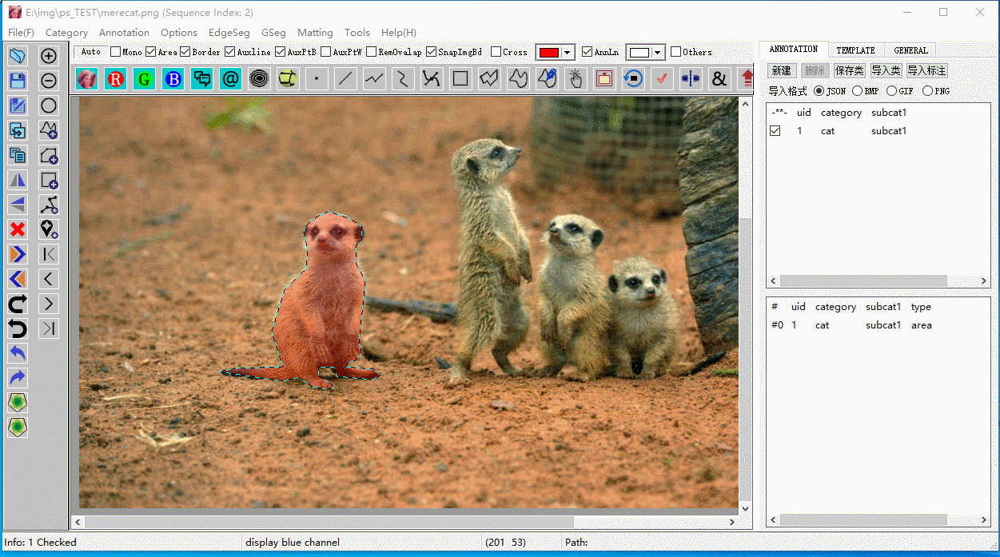
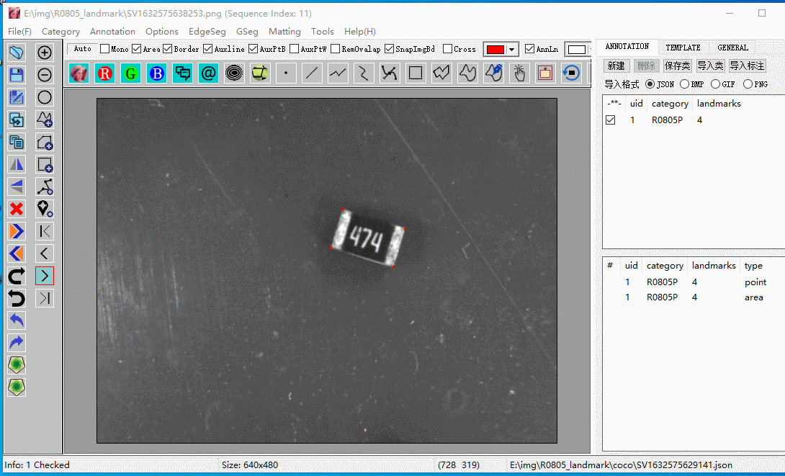

# Software tools Updated

AutoSegProfessional is a free software for image annotation.

It can handle various annotation in a very fast and handy manner.

It has much more function than you have ever expected. 

Let's dig them out!

# NOTE:
  the reason of delayed update is that, the software is written according to some special habits, 
  and there are lots of improvements waiting for update!
  Now it seems I don't have time for all of it.
  Hope you enjoy it. Everybody can send me notes when there are problems, just I cannot promise immediate update.

  I developed this software tools in 2018, for segment annotation it still has the highest accuracy as far as I know.
  The segmentation tutorial is at
  https://github.com/SpaceView/AutoSegProfessional/tree/main/tutorial_AutoEdge_AutoSeg

  for other tutorials, please go to relevent folder.

# Something Interesting

pixel leve high accuracy annotaiton

matting

# AutoSeg Professional

The most convenient, fast, and modern annotation tool.

You can 

(1) annotate your image at pixel level, as fast as the speed to annotate a polygon

(2) annotate your image at pixel with just a single click, with presented template techniques

(3) annotate your landmarks with BBOX automatically generated

.....

You can also

(1) Extract images or foregrounds similar to PS

(2) Matting 

...

And You can do some batch work

(1) rename or resize all images to another folder

(2) generate rotated images and rotated annotations at the same time

(3) Upgrade all your annotations from any type to area

.....

Well, too mush to say, just refer to the specifics.

# Tutorials

### AutoEdge generation at pixel level

### landmark annotation

# Batch Operation

### Generate Rotated Images and Annotations (in this example a copy is save for every 10 degrees)

(1) Generate Rotated Images & Annotations

（2）Check Generated Results

# Advanced Techniques

**Please refer to the <advanced_tutorial> subfolder for more detailed tutorials.**

Replace Unwanted Image Parts with Random Background

COPY and Paste image areas, select any way as you like

