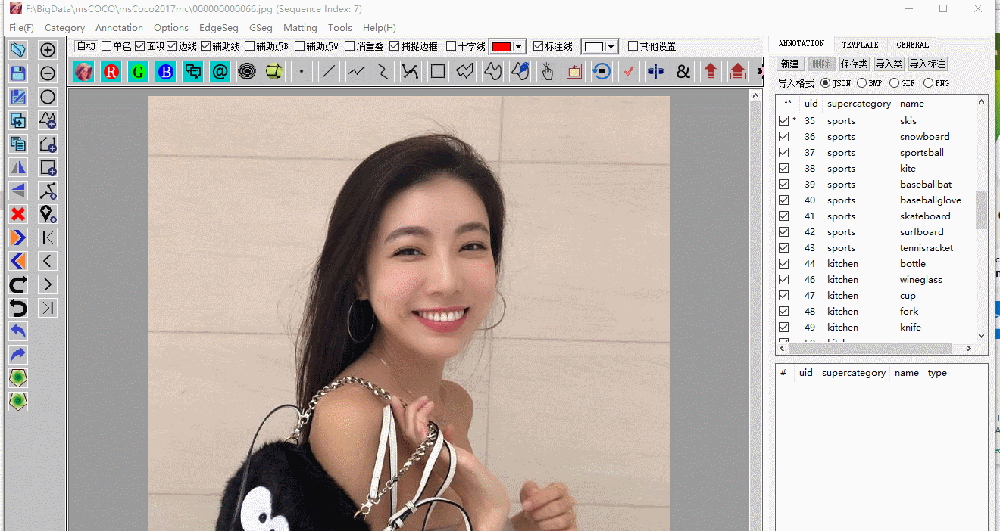
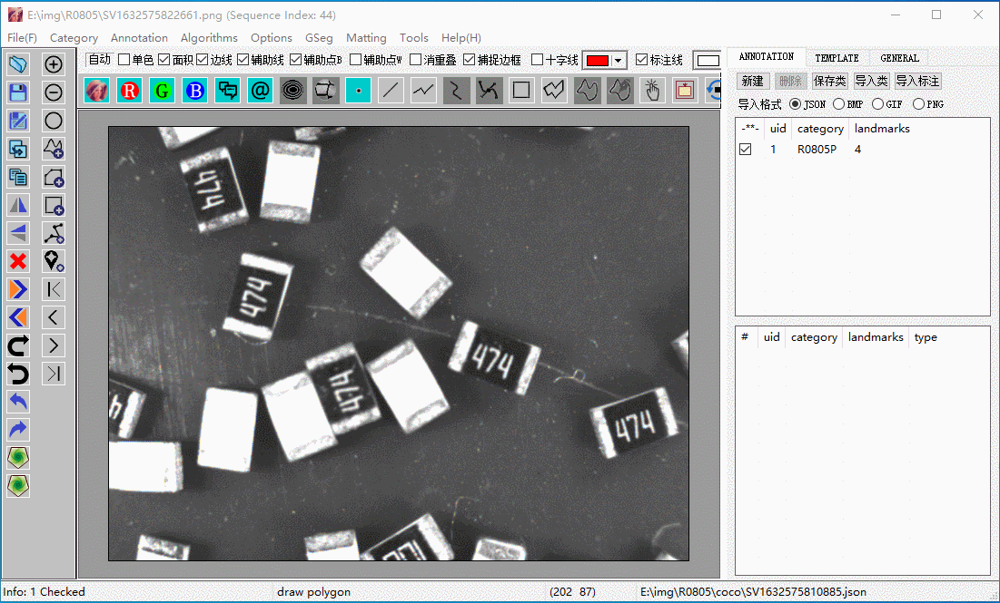
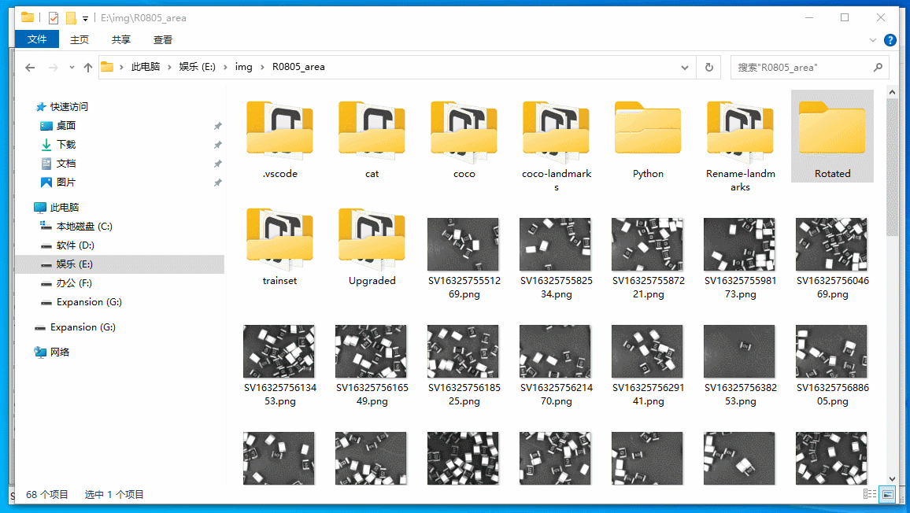
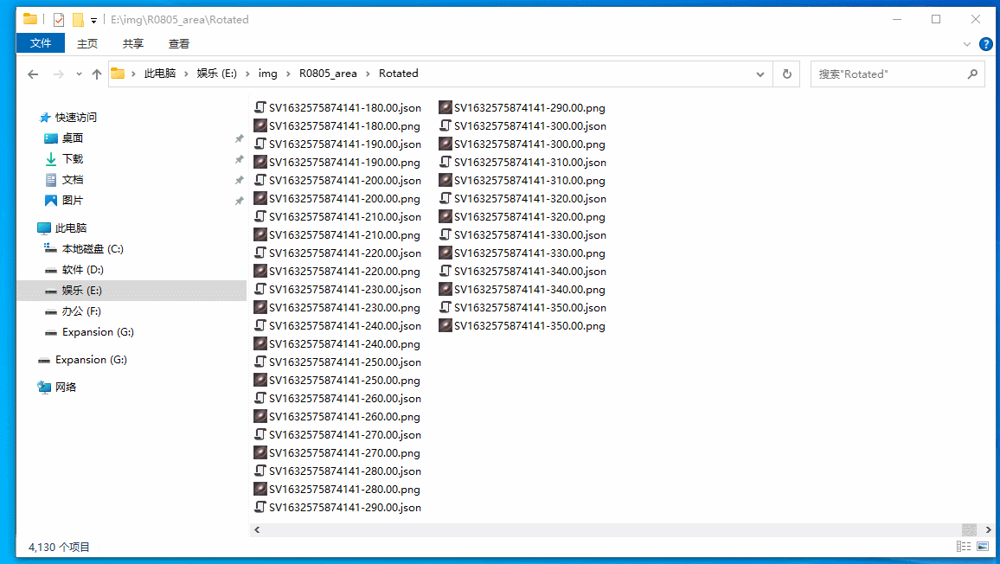
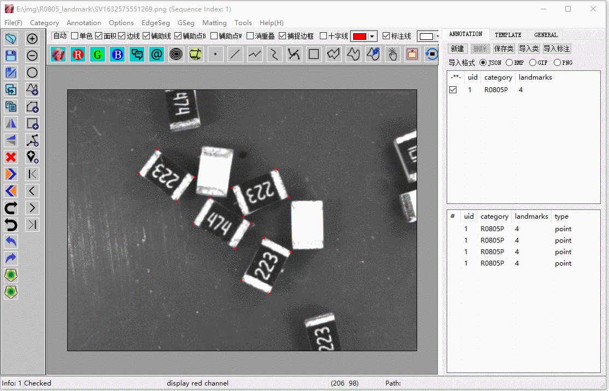

# IN PROCESS of uploading, currently just tutorials, no software tools available

# AutoSeg Professional

The most convenient, fast, and modern annotation tool.

You can 

(1) annotate your image at pixel level, as fast as the speed to annotate a polygon

(2) annotate your image at pixel with just a single click, with presented template techniques

(3) annotate your landmarks with BBOX automatically generated

.....

You can also

(1) Extract images or foregrounds similar to PS

(2) Matting 

...

And You can do some batch work

(1) rename or resize all images to another folder

(2) generate rotated images and rotated annotations at the same time

(3) Upgrade all your annotations from any type to area

.....

Well, too mush to say, just refer to the specifics.

# Tutorials

### AutoEdge generation at pixel level

### landmark annotation

# Batch Operation

### Generate Rotated Images and Annotations (in this example a copy is save for every 10 degrees)

(1) Generate Rotated Images & Annotations

（2）Check Generated Results

# Advanced Techniques

Replace Unwanted Image Parts with Random Background

